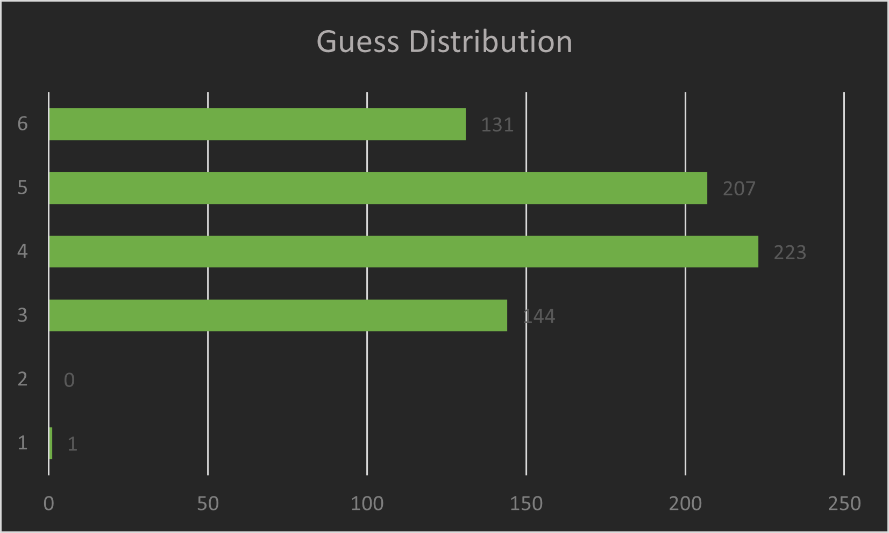

# Wordle
A Wordle simulator for testing WordleBots in C#

## About Regina
Regina the bot plays Wordle by starting off with the same 2 words before selecting a valid word from `five_letter_words.txt` for her subsequent guesses. The file `scores.csv` contains all of Regina's Wordle data, including the date, Wordle #, answer, and score. The `file_of_shame.csv` lists all the times Regina beat her creator and includes both of their scores. As of [George Washington](https://en.wikipedia.org/wiki/George_Washington)'s 292nd birthday, Regina is retired from playing Wordle.

## Regina's Final Stats

### Overview
| Played | Win % | Max Streak | Average |  
|:------:|:-----:|:----------:|:-------:|
| [^1]979| 72.1  | 21         | 5.5     |

[^1]: includes Wordle 0

### Distribution
